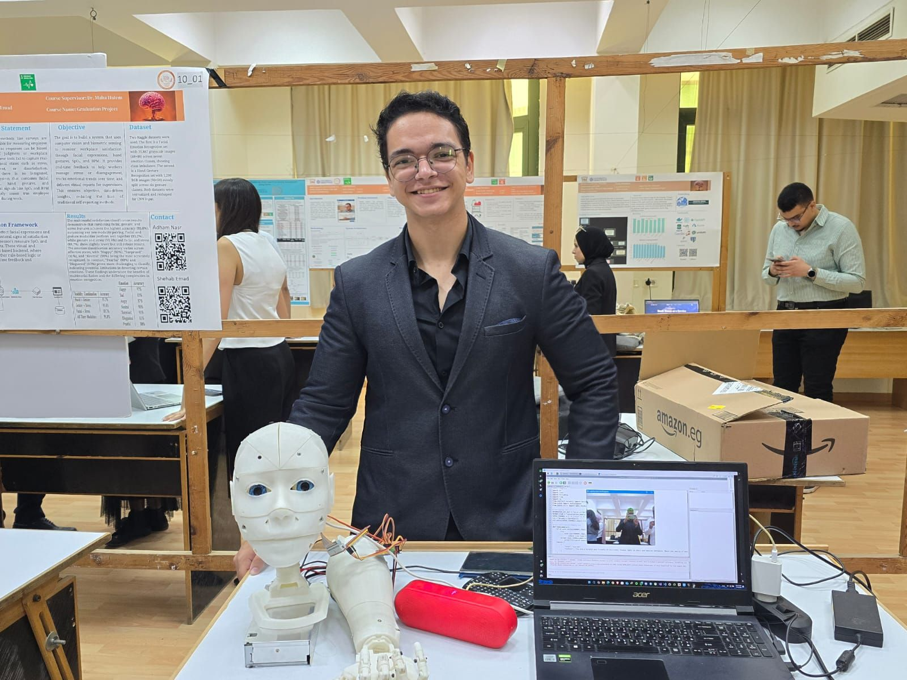
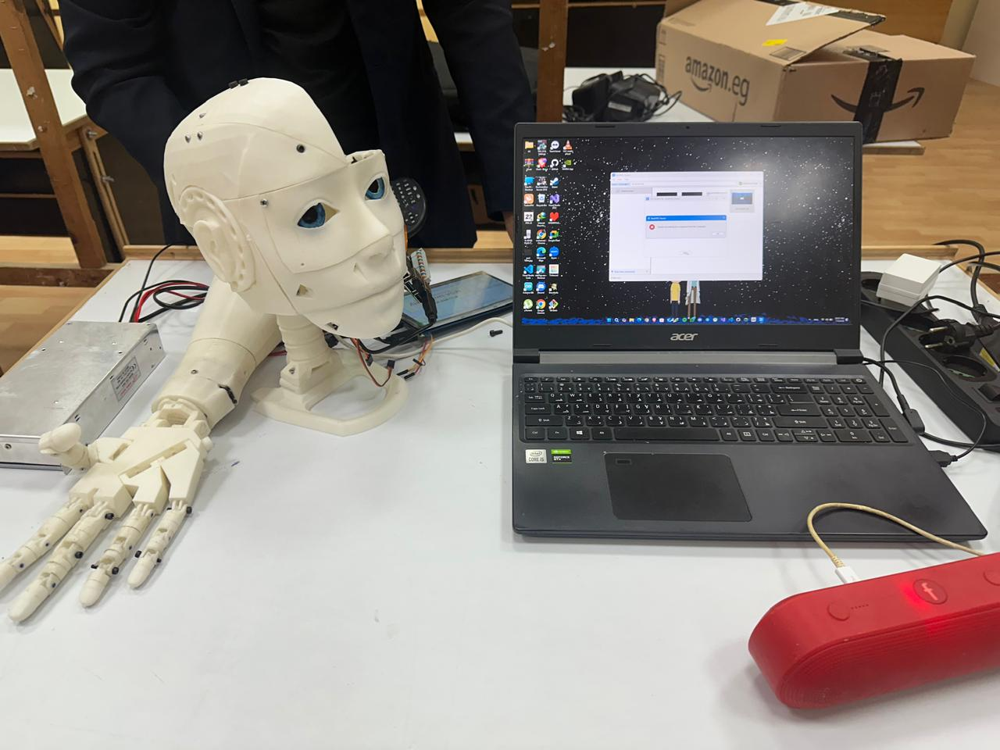
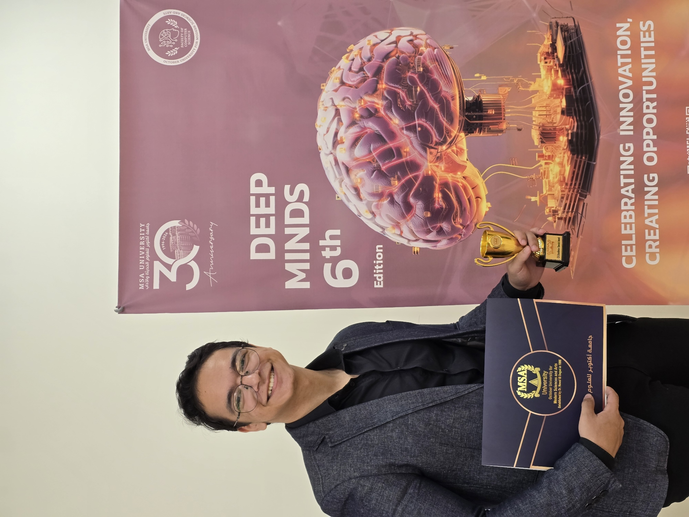

# 🤖 AI Tutor Robotic Head

> **Best Special Project** — Modern Sciences and Arts University | Computer Science Track (All Four Academic Years)

---






## 📖 Overview

An interactive robotic head designed to function as an AI-powered tutoring assistant. The system integrates **computer vision** and **conversational AI** to create a robot capable of recognizing students, understanding its surroundings, and providing personalized educational assistance through natural conversation.

---

## 🏗️ System Architecture

The system combines multiple deep learning components for perception and intelligent interaction:

```
┌─────────────────────────────────────────────┐
│              AI Tutor Robotic Head           │
├──────────────────┬──────────────────────────┤
│  Computer Vision │   Conversational AI      │
│  ─────────────── │   ──────────────────     │
│  • YOLOv8        │   • Mistral LLM          │
│  • MobileNet     │   • Prompt Engineering   │
│  • ResNet-100    │                          │
└──────────────────┴──────────────────────────┘
```

---

## 🧠 Components

### Object Detection
- **Model:** YOLOv8
- Real-time detection of objects in the environment
- Enables contextual and engaging tutoring sessions by incorporating surroundings into interaction

### Face Detection
- **Model:** MobileNet (lightweight CNN)
- Efficient real-time inference with strong detection performance
- Selected for its speed and accuracy balance in live applications

### Face Recognition
- **Model:** ResNet-100
- Generates facial embeddings to identify returning students
- Enables personalized tutoring experiences tailored to each individual

### Conversational AI
- **Model:** Mistral LLM
- Processes student questions and generates context-aware explanations
- Functions as an interactive educational assistant

### Prompt Engineering
- Structured prompting techniques to initialize LLM with educational objectives
- Enables the robot to explain concepts, guide problem-solving, and maintain learning conversations

---

## ✨ Key Features

- 🎥 **Real-time computer vision** perception
- 👤 **Student identification** via face recognition
- 💬 **AI-powered conversational tutoring**
- 🧑‍🎓 **Personalized interaction** for each user
- 🔗 **Multimodal integration** of vision and language models

---

## 👨‍💻 My Role

Responsible for designing and implementing the full machine learning architecture:

- Built the computer vision pipeline for object detection and face detection
- Developed the face recognition system
- Integrated the conversational AI module
- Designed prompt engineering strategies to enable tutoring behavior
- Connected visual perception with conversational intelligence

---

## 📚 References

| Resource | Link |
|----------|------|
| YOLOv8 – Ultralytics Documentation | [docs.ultralytics.com](https://docs.ultralytics.com) |
| MobileNet Architecture Paper | [arxiv.org/abs/1704.04861](https://arxiv.org/abs/1704.04861) |
| ResNet Paper | [arxiv.org/abs/1512.03385](https://arxiv.org/abs/1512.03385) |
| Mistral AI Documentation | [docs.mistral.ai](https://docs.mistral.ai) |

---

## 🏆 Recognition

🥇 **Best Special Project** — Modern Sciences and Arts University  
📌 Computer Science Track — All Four Academic Years
